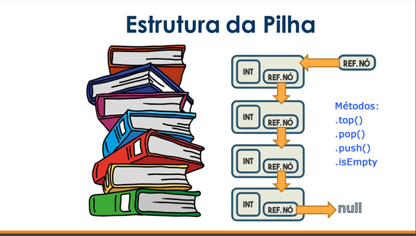
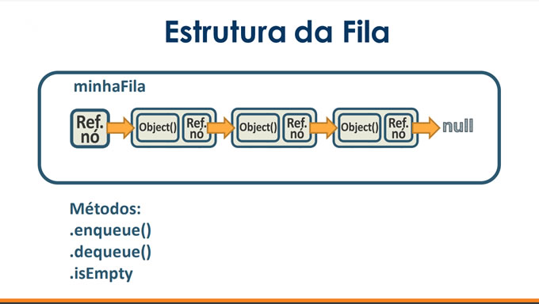
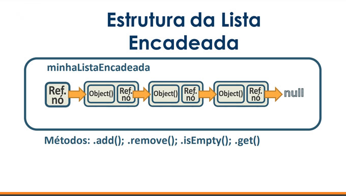
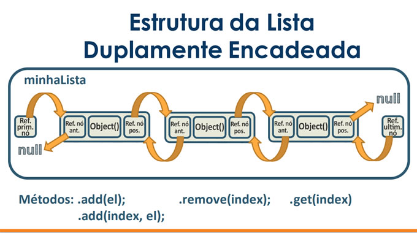
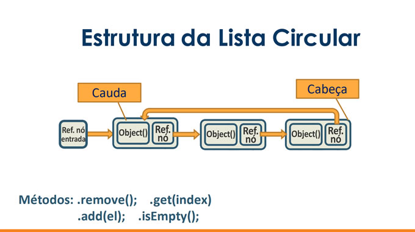
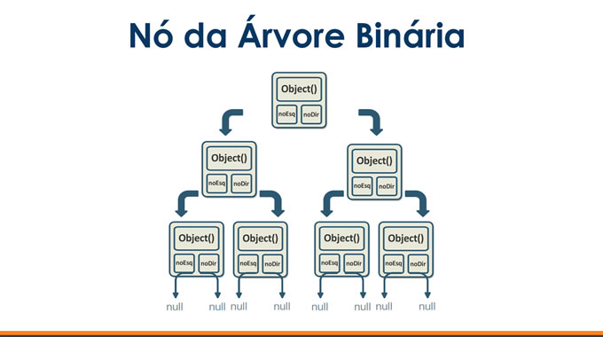

<h1 align="center"> Estrutura de Dados </h1>

Estruturas de dados são fundamentais na área da ciência da computação, pois permitem armazenar e organizar dados de forma eficiente e acessível. 
Existem diversos tipos de estruturas de dados, como arrays, listas encadeadas, árvores e grafos, cada uma com suas particularidades e vantagens em diferentes situações. 
Ao entender e escolher a estrutura de dados adequada, é possível otimizar o desempenho de algoritmos e tornar o processamento de grandes quantidades de informações mais rápido e eficiente.

As seguintes estruturas de dados serão exibidas neste arquivo: 

✅ PILHA  
✅ FILA  
✅ LISTA ENCADEADA   
✅ LISTA DUPLAMENTE ENCADEADA  
✅ LISTA CIRCULAR  
✅ ÁRVORE BINÁRIA  

----

### PILHA (LIFO)

Pilha: é uma estrutura de dados do tipo LIFO (Last In, First Out), ou seja, o último elemento a entrar na pilha é o primeiro a sair. 
É muito utilizada em algoritmos de recursão, em que é necessário armazenar temporariamente os resultados de chamadas de funções para que possam ser utilizados posteriormente.

	
### FILA (FIFO)

Fila: é uma estrutura de dados do tipo FIFO (First In, First Out), ou seja, o primeiro elemento a entrar na fila é o primeiro a sair. 
É utilizada em situações em que é necessário manter uma ordem de processamento ou atendimento, como em sistemas de impressão ou em filas de espera em hospitais.

	
### LISTA ENCADEADA

Lista encadeada: é uma estrutura de dados que consiste em uma sequência de elementos chamados de nós, onde cada nó contém um valor e um ponteiro para o próximo nó. 
É possível adicionar ou remover elementos em qualquer posição da lista de forma eficiente.

	
### LISTA DUPLAMENTE ENCADEADA

Lista duplamente encadeada: é uma variação da lista encadeada onde cada nó possui um ponteiro para o próximo e para o nó anterior. Isso permite percorrer a lista nos dois sentidos e remover elementos de forma mais eficiente.

### LISTA CIRCULAR

Lista circular: é uma variação da lista encadeada onde o último nó possui um ponteiro para o primeiro nó, formando assim um ciclo. Isso permite percorrer a lista de forma contínua e adicionar ou remover elementos de forma mais eficiente.

### ÁRVORE BINÁRIA

Árvore binária: é uma estrutura de dados em forma de árvore onde cada nó possui no máximo dois filhos. É utilizada para armazenar dados hierarquicamente e é comumente utilizada em algoritmos de busca e ordenação, como o algoritmo de busca binária. 

----

Feito por [Edielson Assis](https://www.linkedin.com/in/edielson-assis) :wave:
